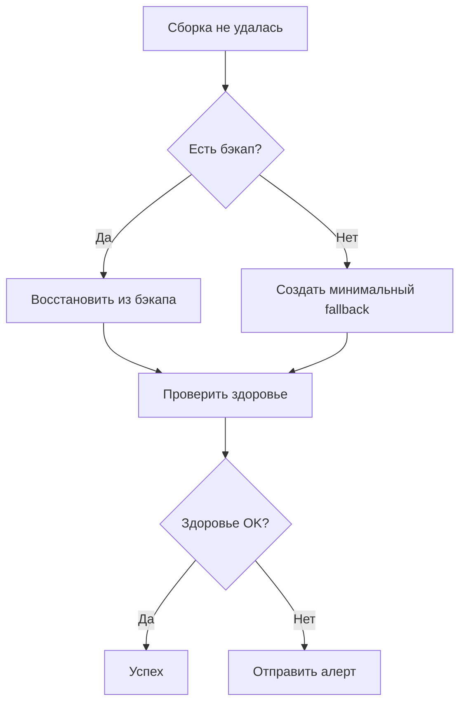

# 🛡️ Система Fallback для Coffee Admin

## 📋 Обзор

Реализована комплексная система fallback, которая предотвращает падение сервера при неудачной сборке приложения. Система автоматически подставляет последнюю успешную сборку при возникновении проблем.

## 🎯 Проблема, которую решает

**До внедрения:**
- При неудачной сборке весь сервер падал
- Нет механизма отката на рабочую версию
- Отсутствуют health checks
- Нет автоматического восстановления

**После внедрения:**
- ✅ Автоматический fallback на последнюю рабочую версию
- ✅ Health checks для всех сервисов
- ✅ Автоматическое создание бэкапов
- ✅ Мониторинг и алерты
- ✅ Graceful degradation

## 🏗️ Архитектура решения

### 1. Docker с Fallback механизмом

#### Backend (`Dockerfile.fallback`)
```dockerfile
# Сборка с автоматическим fallback
RUN /app/build-with-fallback.sh

# Скрипт создает:
# - Бэкап успешной сборки
# - Откат на предыдущую версию при ошибке
# - Минимальный fallback при отсутствии бэкапов
```

#### Frontend (`Dockerfile.fallback`)
```dockerfile
# Аналогичный механизм для frontend
# Создает maintenance page при полном отсутствии бэкапов
```

### 2. Docker Compose с Fallback (`docker-compose.fallback.yml`)

```yaml
services:
  backend:
    build:
      dockerfile: Dockerfile.fallback
    healthcheck:
      test: ["CMD", "wget", "--no-verbose", "--tries=1", "--spider", "http://localhost:3001/api/health"]
  
  frontend:
    build:
      dockerfile: Dockerfile.fallback
    healthcheck:
      test: ["CMD-SHELL", "wget --no-verbose --tries=1 --spider http://localhost:80 || exit 1"]
```

### 3. Health Check Endpoint

Добавлен endpoint `/api/health` в backend:
```typescript
@Get('health')
getHealth() {
  return { 
    status: 'ok', 
    message: 'Service is healthy', 
    timestamp: new Date().toISOString(),
    uptime: process.uptime(),
    memory: process.memoryUsage(),
    version: process.env.npm_package_version || '1.0.0'
  };
}
```

## 🛠️ Компоненты системы

### 1. Fallback Manager (`scripts/fallback-manager.sh`)

Универсальный скрипт для управления fallback механизмом:

```bash
# Создать бэкап
./scripts/fallback-manager.sh backup backend /app/dist

# Восстановить из бэкапа
./scripts/fallback-manager.sh restore backend /app/dist

# Сборка с fallback
./scripts/fallback-manager.sh build backend 'npm run build' /app/dist http://localhost:3001/api/health

# Список бэкапов
./scripts/fallback-manager.sh list backend

# Проверка здоровья
./scripts/fallback-manager.sh health backend http://localhost:3001/api/health
```

### 2. Deploy with Fallback (`deploy-with-fallback.sh`)

Улучшенный скрипт деплоя с поддержкой fallback:

```bash
# Деплой с автоматическим fallback
./deploy-with-fallback.sh

# Особенности:
# - Создание бэкапа перед деплоем
# - Health checks после деплоя
# - Автоматический откат при проблемах
# - Восстановление из бэкапа
```

### 3. System Monitor (`scripts/system-monitor.sh`)

Система мониторинга и алертов:

```bash
# Комплексная проверка здоровья
./scripts/system-monitor.sh check

# Статус системы
./scripts/system-monitor.sh status

# Автоматическое восстановление
./scripts/system-monitor.sh recover

# Непрерывный мониторинг
./scripts/system-monitor.sh monitor
```

### 4. GitHub Actions с Fallback

Новый workflow (`.github/workflows/deploy-with-fallback.yml`):

```yaml
# Особенности:
# - Сборка с fallback на GitHub
# - Health checks после деплоя
# - Автоматический rollback при проблемах
# - Уведомления о статусе
```

## 🚀 Использование

### Быстрый старт

1. **Использование fallback Docker Compose:**
```bash
# Запуск с fallback механизмом
docker-compose -f docker-compose.fallback.yml up -d --build
```

2. **Деплой с fallback:**
```bash
# Деплой с автоматическим fallback
./deploy-with-fallback.sh
```

3. **Мониторинг:**
```bash
# Проверка здоровья системы
./scripts/system-monitor.sh check

# Непрерывный мониторинг
./scripts/system-monitor.sh monitor
```

### Настройка переменных окружения

```bash
# Для мониторинга
export VPS_HOST="192.144.12.102"
export VPS_USER="root"
export ALERT_EMAIL="admin@example.com"
export WEBHOOK_URL="https://hooks.slack.com/..."
export CHECK_INTERVAL=60
```

## 📊 Мониторинг и алерты

### Health Checks

1. **Backend Health Check:**
   - URL: `http://localhost:3001/api/health`
   - Проверка: статус, uptime, память, версия

2. **Frontend Health Check:**
   - URL: `http://localhost:4000`
   - Проверка: доступность страницы

3. **Docker Containers:**
   - Проверка статуса контейнеров
   - Обнаружение unhealthy контейнеров

4. **Системные ресурсы:**
   - Дисковое пространство (порог: 80%)
   - Использование памяти (порог: 80%)

### Алерты

- **Email уведомления** (если настроен `ALERT_EMAIL`)
- **Webhook уведомления** (если настроен `WEBHOOK_URL`)
- **Логирование** в `/var/log/system-monitor.log`

## 🔧 Конфигурация

### Настройка бэкапов

```bash
# Максимальное количество бэкапов (по умолчанию: 5)
MAX_BACKUPS=5

# Директория для бэкапов
BACKUP_DIR="/app/builds"
```

### Настройка health checks

```bash
# Таймаут для health checks (секунды)
HEALTH_CHECK_TIMEOUT=60

# Количество попыток
MAX_RETRIES=3
```

### Настройка мониторинга

```bash
# Интервал проверки (секунды)
CHECK_INTERVAL=60

# Пороги для алертов
DISK_THRESHOLD=80
MEMORY_THRESHOLD=80
```

## 🛡️ Стратегия Fallback

### Уровни Fallback

1. **Уровень 1: Локальный fallback**
   - Использование последней успешной сборки
   - Автоматическое создание бэкапов

2. **Уровень 2: Удаленный fallback**
   - Восстановление из бэкапа на сервере
   - Откат к предыдущей версии

3. **Уровень 3: Минимальный fallback**
   - Maintenance page для frontend
   - Базовый API endpoint для backend

### Процесс восстановления



## 📈 Преимущества

### Надежность
- ✅ Нулевое время простоя при неудачной сборке
- ✅ Автоматическое восстановление
- ✅ Graceful degradation

### Мониторинг
- ✅ Комплексные health checks
- ✅ Автоматические алерты
- ✅ Детальная диагностика

### Управление
- ✅ Автоматические бэкапы
- ✅ Простое восстановление
- ✅ Централизованное управление

## 🔍 Диагностика проблем

### Проверка статуса

```bash
# Общий статус системы
./scripts/system-monitor.sh status

# Проверка здоровья
./scripts/system-monitor.sh check

# Список бэкапов
./scripts/fallback-manager.sh list backend
```

### Логи

```bash
# Логи мониторинга
tail -f /var/log/system-monitor.log

# Логи Docker контейнеров
docker logs coffee_backend_fallback
docker logs coffee_frontend_fallback
```

### Ручное восстановление

```bash
# Принудительное восстановление
./scripts/fallback-manager.sh force-restore backend /app/dist

# Перезапуск сервисов
docker-compose -f docker-compose.fallback.yml restart
```

## 🚨 Аварийные процедуры

### Полный отказ системы

1. **Проверить статус:**
```bash
./scripts/system-monitor.sh status
```

2. **Попытаться восстановление:**
```bash
./scripts/system-monitor.sh recover
```

3. **Ручной откат:**
```bash
# Найти последний бэкап
ls -la ~/coffe/backups/

# Восстановить из бэкапа
tar -xzf ~/coffe/backups/backup-YYYYMMDD_HHMMSS.tar.gz -C ~/coffe
```

4. **Перезапуск:**
```bash
docker-compose -f docker-compose.fallback.yml up -d
```

## 📝 Заключение

Система fallback обеспечивает:

- **Высокую доступность** - сервер не падает при неудачной сборке
- **Автоматическое восстановление** - система сама восстанавливается
- **Мониторинг** - постоянное отслеживание состояния
- **Простое управление** - все операции автоматизированы

Теперь при неудачной сборке приложения система автоматически подставит последнюю успешную сборку, обеспечивая непрерывную работу сервиса.
